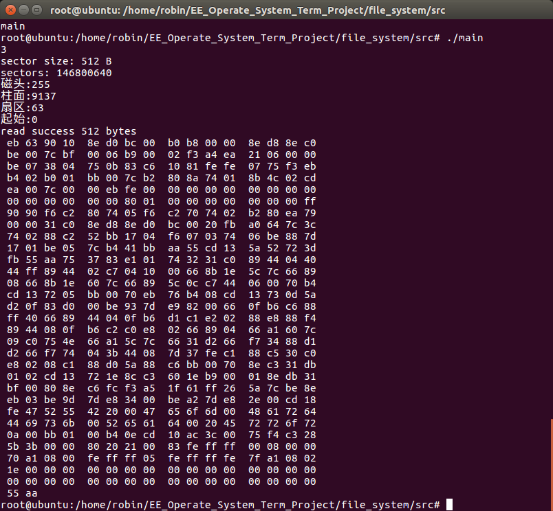
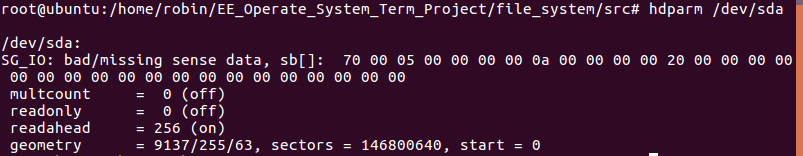
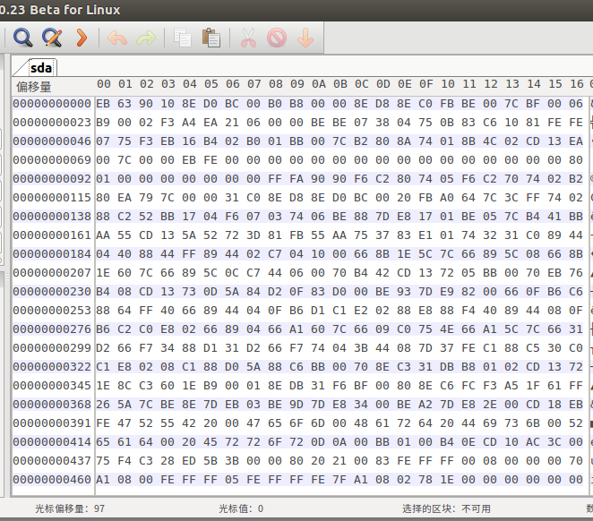

# 磁盘IO

## 1、问题描述：

> 通过针对磁盘进行I/O实验，了解与掌握直接访问磁盘扇区的方法。要求实现三个函数：
>
> 1. physicalDisk：判定逻辑驱动器X中磁盘的基本信息
> 2. sectorRead：根据给定的物理扇区号读取磁盘的扇区
> 3. sectorDump：查看磁盘的内容并把磁盘上得到的信息输出到标准输出流。


## 2、实验环境：

Ubuntu16.04LTS


## 3、函数实现：

### (1) sectorRead:

该函数较简单实现，通过open函数打开对应磁盘，设要读取第x个扇区，通过ioctl(fd,BLKSSZGET,&size）可以获取一个扇区的大小size，进而可以利用read函数进行读取，详细的函数如下：

```C
int get_sector_size(int fd){
    //get sector size of fd
    int size;
    ioctl(fd,BLKSSZGET,&size);
    return size;
}

int sectorRead(int fd, unsigned long sectorID, char **p){
    int sector_size = get_sector_size(fd);
    lseek(fd,0,SEEK_SET);				//指针移动到开头
    if(lseek(fd,sectorID * sector_size,SEEK_CUR) == -1){	
        //将指针移动到对应位置
        std::cerr << "no such sector" << std::endl;
    }
    //读取一扇区的数据
    *p = new char[sector_size];
    return read(fd,*p,sector_size);
}

```


### (2) sectorDump：

该函数实现将读取的信息通过16进制显示出来。我们只需要将sectorRead中读取的数据转换为16进制数即可。详细函数如下：

```c
void sectorDump(char *p, int size){
    int line_num = 16;				//每行显示的数据数
    int i = 0;
    while( i < size ){
        unsigned char a = (*(p+i));	//读取第i个数据(char)
        if( line_num == 0 ){
            std::cout << std::endl;
            line_num = 16;
        }
        else{
            unsigned short l = a & 0x0f;
            unsigned short h = (a & 0xf0)>>4;
            std::cout.setf(std::ios_base::right, std::ios_base::adjustfield);
            std::cout.fill(' ');
            std::cout.width(2);
            std::cout <<std::hex<< h << l ;
			//将数据按16进制输出
            
            line_num --;
            if(line_num % 4 ==0 )
                std::cout << " ";
        }
        i++;
    }
    std::cout << std::endl;
}
```


### (3) physicalDisk:

此函数读取磁盘驱动器的基本信息。在linux下读取设备的基本信息接口为ioctl。

首先考虑读取磁盘结构，根据源码查到如下结构体：

```C
struct hd_geometry {
      unsigned char heads;
      unsigned char sectors;
      unsigned short cylinders;
      unsigned long start;
};
```

此结构描述磁盘布局，故而我们可以通过如下代码得到磁盘布局并输出：

```c
hd_geometry hdio;
ioctl(fd,HDIO_GETGEO,&hdio);
```

此外可以通过标识符BLKGETSIZE64得到磁盘大小信息：

```c
long long disk_size;
ioctl(fd,BLKGETSIZE64,&disk_size);
```

获取扇区大小通过之前定义的函数get_sector_size即可。

综上，physicalDisk代码如下：

```c
void physicalDisk(int fd){
    //get basic infomation about disk
    int size;
    ioctl(fd,BLKSSZGET,&size);
    //获取扇区大小
    long long disk_size;
    ioctl(fd,BLKGETSIZE64,&disk_size);
    //获取磁盘大小
    hd_geometry hdio;
    ioctl(fd,HDIO_GETGEO,&hdio);
    //获取磁盘布局
    
    //输出磁盘信息
    std::cout << "sector size: " << size << " B " << std::endl
             <<"disk size: " << disk_size/size  << std::endl
            <<"磁头:" << int(hdio.heads) <<std::endl
           <<"柱面:"<<hdio.cylinders << std::endl
          <<"扇区:"<< int(hdio.sectors) << std::endl
         <<"起始:"<< hdio.start << std::endl;
}
```


### (4) 、测试程序：

我们通过对磁盘/dev/sda进行读取基本信息以及读取第0个扇区并输出。程序如下：

```C
int main(int argc, char *argv[])
{
    int fd = open("/dev/sda",O_RDONLY);
    std::cout << fd << std::endl;
   
    physicalDisk(fd);
    char * p;

    int a = sectorRead(fd,0,&p);
    if(a>=0){
        std::cout << "read success " << a << " bytes " << std::endl;
        sectorDump(p,a);
    }
    else{
        std::cout << "reading error" << std::endl;
    }
}

```


## 4、验证：

在root下编译main.cpp并运行：

```shell
g++ main.cpp -o main
./main
```

得到如下结果：



通过命令：

```shell
hdparm /dev/sda
```

查看磁盘信息：



可以看出结果一致。

通过软件wxhexeditor可以查看磁盘的16进制数据，对/dev/sda的第0个扇区查看得到如下结果：



经过对比可以看出结果是一样的。函数正确性得到验证。

## 5、总结：

通过以上的磁盘操作让我对直接磁盘IO有了深入的认识，本来想通过写这些函数来写FAT文件系统作业，但是拖延症的我时间不够，只能将此交上去，甚是遗憾。