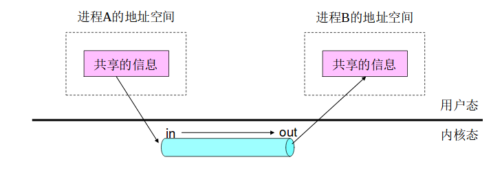
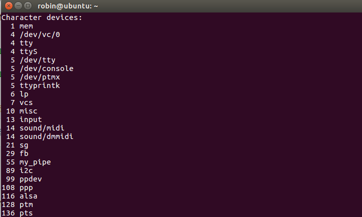
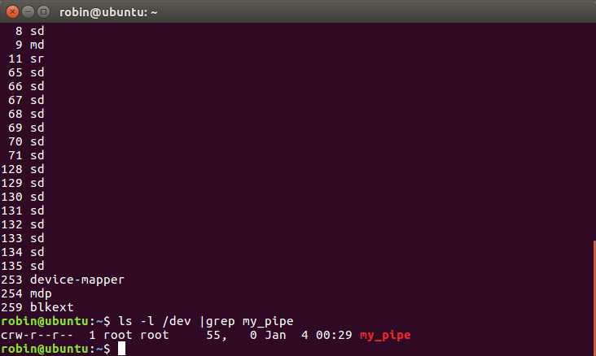

# 管道驱动程序开发

## 林仲航	无63	2016011051

## 1、问题描述：

编写一个设备驱动程序mypipe实现管道，该驱动程序创建两个设备实例，一个针对管道的输入端，另一个针对管道的输出端。原理图如下：



## 2、实验环境：

- 操作系统：Ubuntu16.04LTS
- 内核版本：4.15.0-43-generic


## 3、原理简述：

管道驱动程序可以理解为一个设备，通过编写该设备的一系列函数（file_operation)，并讲该设备插入到内核中，即可通过系统调用使用该设备的一系列功能。以下根据代码阐述管道驱动程序的组成。

### (1) 字符设备的注册与销毁：

首先，每个设备都需要一个主设备号与次设备号，由于只在本人电脑上进行实验，采取简单方法，分配my_pipe的主设备号为55，次设备号为0，此外需要定义对应my_pipe的file_operations结构，通过较老版本的注册函数register_chrdev()注册该设备。（之所以没有用较新方法，原因在于遇到了不可抗bug）相关代码如下：

```C
static const char* my_dev_name = "my_pipe";
static unsigned int pipe_major = 55;    //主设备号
static unsigned int pipe_minor = 0;     //次设备号

//需要重写的file_operation函数
static ssize_t my_pipe_read(struct file* f, char* , size_t size, loff_t* ppos);
static ssize_t my_pipe_write(struct file* f, const char*, size_t size, loff_t* ppos);
static int my_pipe_open(struct inode* inode, struct file* f);
static int my_pipe_release(struct inode* inode, struct file *f);


static struct file_operations my_pipe_fo = {    //文件操作结构
    .owner = THIS_MODULE,
    .open  = my_pipe_open,
    .write = my_pipe_write,
    .read  = my_pipe_read,
    .release = my_pipe_release,
};

static int __init my_pipe_init(void){   //字符设备注册
    int dev_id = register_chrdev(pipe_major,my_dev_name,&my_pipe_fo);
    my_pipe_device.wr = 0;
    my_pipe_device.rd = 0;
    my_pipe_device.data_size = 0;
    sema_init(&my_pipe_device.sem,1);
    return 0;
}
```

当然还需要unregister_chrdev进行字符设备注销：

```C
static void my_pipe_exit(void){ //字符设备删除
    printk(KERN_INFO"my_pipe exit\n");
   	unregister_chrdev(pipe_major,my_dev_name);
}
```

最后将重写的函数定向到该模块的init与exit函数中：

```C
module_init(my_pipe_init);
module_exit(my_pipe_exit);

MODULE_LICENSE("GPL");
MODULE_AUTHOR("Robin");


```


### (2) Open与Release函数：

由于my_pipe的定位仅是一个简单的字符设备，故这两个函数内部不需做什么操作，只需返回0，对应于open与release总是成功。

```C
static int my_pipe_open(struct inode* inode, struct file* filp){
    printk(KERN_INFO"open\n");
    return 0;
}

static int my_pipe_release(struct inode* inode, struct file* f){
    printk(KERN_INFO "my_pipe release\n");
    return 0;
}
```


### (3) 需要使用的数据结构：

my_pipe设备主要的函数即为read与write函数，在此先介绍需要用到的数据结构。

```C
struct pipe_struct{
    char buffer[BUFF_SIZE];			//数据缓冲区
    struct semaphore sem;			//信号量
    int wr;							//写入位置
    int rd;							//读取位置
    int data_size;					//数据量
};
struct pipe_struct my_pipe_device;  //整个设备使用期间用的数据
```

如上定义了整个设备所需的数据结构。buffer存储外部输入的信息。信号量sem完成互斥操作，防止同时读同时写的问题发生。wr与rd指示当前写与读的位置（可以理解为对应指针的位置）。data_size指示当前数据缓冲区的数据量。整个设备工作原理如下图所示：


### (4) read函数：

read函数主要实现的功能有：

1. 互斥，当前仅有一个进程可以进行读取操作，此时其它读取或写入进程均睡眠，直到完成了读取操作为止
2. 根据函数传入的参数size，将数据复制到用户空间中
3. 返回一个整形数，对应于成功读取的数据量数目count
4. 更新rd与data_size

数据区buffer类似一个循环队列，读取count个数据后，rd位置移动count位。下一次读取从buffer+rd开始。

由于内核空间与用户空间地址不同，不能直接对指针进行操作，需要用到copy_to_user函数实现数据传递。

具体实现如下：

```C
static ssize_t my_pipe_read(struct file *f, char* __user data, size_t size, loff_t* ppos){
    struct pipe_struct* pipe_device = &my_pipe_device;//f->private_data;
    int count;
    int fir;
    int sec;
    
    printk(KERN_INFO "read.\n");

    down(&pipe_device->sem);	//互斥操作
    count = (size <= pipe_device->data_size) ? size : pipe_device->data_size;     
    //需要读取的字节数
    
    if(pipe_device->rd + count <= BUFF_SIZE){		//只需进行一次读取
        if(copy_to_user(data,pipe_device->buffer+pipe_device->rd,count) != 0){
            printk(KERN_WARNING "copy to user error.\n");
            up(&pipe_device->sem);
            return -EFAULT;
        }
    }
    else {		//需要进行两次读取，一次读到末尾，另一次从0开始读
        int fir = BUFF_SIZE - pipe_device->rd;
        int sec = count - fir;

        if(copy_to_user(data, pipe_device->buffer+pipe_device->rd, fir) != 0){
            printk(KERN_WARNING "copy to user 1st error\n");
            up(&pipe_device->sem);
            return -EFAULT;
        }
        
        if(copy_to_user(data+fir,pipe_device->buffer,sec) != 0){ 
            //若第二次失败，返回已读出的数据量
            printk(KERN_WARNING "copy to user 2rd error.\n");
            pipe_device->data_size -= fir;
            pipe_device->rd = 0;
            up(&pipe_device->sem);
            return fir;			
        }
    }

    pipe_device->data_size -= count;
    pipe_device->rd = (pipe_device->rd + count) % BUFF_SIZE;
    up(&pipe_device->sem);
    return count;
}
```


### (5) write函数：

write函数主要完成功能：

1. 写入由参数size数定下的数据，若缓冲区不够，只写入最大可写数目数据
2. 返回成功写入的数据量
3. 更新wr与data_size
4. 互斥操作，只有当当前进程完成写操作后其它进程才能使用该设备

具体实现与read类似，需要使用copy_from_user函数实现数据传递，具体实现如下：

```C
static ssize_t my_pipe_write(struct file *filp, const char* __user data,size_t size, loff_t * ppos){
    struct pipe_struct* pipe_device = &my_pipe_device;//filp->private_data;
    int count = 0;                          			 //写入数据个数
    int left_space = BUFF_SIZE - pipe_device->data_size; //剩余可写空间
    int fir;
    int sec;
    
    printk(KERN_INFO"write\n");

    down(&pipe_device->sem);
    count = (size <= left_space) ? size : left_space;    //计算需要写入的字节数
    
    if(pipe_device->wr + count < BUFF_SIZE){
        if(copy_from_user(pipe_device->buffer + pipe_device->wr,data,count) != 0){      			//将数据写入
            printk(KERN_WARNING"copy from user error!\n");
            up(&pipe_device->sem);
            return -EFAULT;
        }
        else{
            printk(KERN_INFO"copy from user successfully!\n");
        }
        
    }
    else{//需要写入两次
        fir = BUFF_SIZE - pipe_device->wr;          //第一次写入个数
        sec = count - fir;              			//第二次

        if(copy_from_user(pipe_device->buffer+pipe_device->wr,data,fir) != 0){
            printk(KERN_WARNING"copy from user first error!\n");
            up(&pipe_device->sem);
            return -EFAULT;
        }

        if(copy_from_user(pipe_device->buffer,data+fir,sec) != 0){   
            //若第二次写入失败，返回已写入数据量
            printk(KERN_WARNING"copy from user second error!\n");
            pipe_device->wr = 0;
            pipe_device->data_size += fir;
            up(&pipe_device->sem);
            return fir;
        }
    }

    pipe_device->wr = (pipe_device->wr + count) % BUFF_SIZE;                        
    //移动wr位置
    pipe_device->data_size += count;
    up(&pipe_device->sem);                               
    return count;
}
```


## 4、设备创建/插入：

需要使用内核对该设备进行编译，Makefile文件如下：

```makefile
all:
		make -C /lib/modules/$(shell uname -r)/build M=$(PWD) modules
clean:
		make -C /lib/modules/$(shell uname -r)/build M=$(PWD) clean
		rm -f modules.order

obj-m += my_pipe.o #加载到module的编译链中，内核会编译生成出来ko文件，作为一个模块
```

在文件夹下使用命令make即可进行编译，得到模块my_pipe.ko 。随后输入以下命令：

```
insmod my_pipe.ko
mknod /dev/my_pipe c 55 0
chmod 777 /dev/my_pipe
```

即可完成插入设备到内核，创建设备节点以及修改该设备使用权限操作。此时通过命令cat /proc/devices 可以看到一个主设备号为55的my_pipe字符设备。



利用命令ls -l /dev | grep my_pipe可以查看设备节点信息：



## 5、测试程序简介：

由两个测试程序组成，命名为my_pipe_reader.c与my_pipe_writer.c。顾名思义，就是writer向设备写数据，reader从设备中读取数据并显示。程序如下：

my_pipe_reader.c:

```C
#include <sys/types.h>
#include <sys/stat.h>
#include <fcntl.h>
#include <stdio.h>
#include <unistd.h>

int main(int agrc, char ** argv){
    int fd ;
    int buffer_size = 1024;
    char data[1024];
    printf("reader begin\n");
    
    fd = open("/dev/my_pipe",O_RDONLY);
    printf("%d \n",fd);
    if(fd < 0){
        printf("can't open\n");
    }
    
    while(1){
        int count = read(fd,data,buffer_size);	//将缓冲区数据全部读出
        if(count > 0){
            for(int i = 0; i < count; i++){
                printf("%c",data[i]);
            }
            printf("\n");
        }
    }
    close(fd);
    return 0;
}
```

my_pipe_writer:

```C
#include <sys/types.h>
#include <sys/stat.h>
#include <fcntl.h>
#include <stdio.h>
#include <unistd.h>
#include "string.h"

int main(int agrc, char ** argv){
    int fd;
    int buffer_size = 1024;
    char data[1024];
    printf("writer begin\n");
    fd = open("/dev/my_pipe",O_WRONLY);
    printf("%d \n",fd);

    if(fd < 0){
        printf("can't open\n");
        return 0;
    }
    
    while(1){
        scanf("%s", data);
        write(fd,data,strlen(data));
    }
    close(fd);
    return 0;
}

```

以上程序完成的功能就是writer向my_pipe写入从键盘输入的数据，reader从中读取并显示。通过以下命令编译并调用程序，你可以一直用此自娱自乐。(推荐在root下运行程序)

```shell
gcc my_pipe_reader.c -o reader
gcc my_pipe_writer.c -o writer
./reader
./writer
```


## 6、效果展示：

结果存为视频附在附件result_display.mp4中


## 7、感想：

本次实验主要难点在于写设备的上手中，刚开始我以为需要编译一个内核才能编译驱动，后来发现纯属浪费时间，多亏了StackOverFlow中的大神解决了我的问题。此外，在设备的注册等操作上也花了许多时间。当对整个设备驱动结构有了一定了解后我终于很快速地写完了这个构思很简单的驱动程序。通过这个实验了解了很多linux驱动的知识，感觉linux的万物皆文件的思想非常有趣。


## 8、参考资料：

1. 嵌入式Linux驱动开发（一）——字符设备驱动框架入门：https://www.jianshu.com/p/716ed9cdb8f3
2. 《linux设备驱动程序》